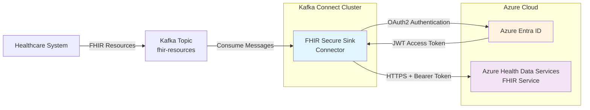

# Kafka FHIR Secure Sink Connector

A production-ready Kafka Connect sink connector for securely sending FHIR resources to Azure Health Data Services using OAuth2 authentication.

## Features

- **Secure Authentication**: OAuth2 integration with Azure Entra ID (Client Credentials flow)
- **FHIR R4 Support**: Full compatibility with FHIR R4 resources using HAPI FHIR
- **Azure Health Data Services**: Native support for Azure's managed FHIR service
- **Resilient Delivery**: Configurable retry logic with exponential backoff
- **Resource Validation**: Optional FHIR resource validation before transmission
- **Token Management**: Automatic OAuth2 token renewal and caching
- **Production Ready**: Comprehensive logging, error handling, and monitoring
- **HTTPS Enforcement**: Mandatory HTTPS for all FHIR server connections

## Azure Health Data Services 2025 Requirements

⚠️ **Important**: Azure API for FHIR is being retired:
- No new deployments after **April 1, 2025**
- Complete retirement on **September 30, 2026**
- Use **Azure Health Data Services** instead

### OAuth2 Authentication (Mandatory)

All Azure Health Data Services FHIR APIs **require** OAuth2 authentication with:
- **Microsoft Entra ID** as identity provider
- **Client Credentials Flow** for service-to-service authentication
- **Bearer Token** authentication with JWT access tokens
- **HTTPS-only** FHIR server endpoints
- **RBAC roles** for fine-grained permissions

## Quick Start

### Prerequisites

- Java 17+
- Maven 3.6+
- Azure Health Data Services FHIR service
- Azure Entra ID application registration with appropriate FHIR permissions

### Build

```bash
mvn clean package
```

The built JAR with dependencies will be created at:
`target/kafka-fhir-secure-sink-1.0.0-SNAPSHOT-jar-with-dependencies.jar`

### Azure Setup

1. **Create FHIR Service** in Azure Health Data Services workspace
2. **Register Application** in Azure Entra ID:
   - Note the `Tenant ID`, `Client ID`
   - Create a `Client Secret`
3. **Assign FHIR Permissions**:
   - Navigate to your FHIR service → Access control (IAM)
   - Add role assignment: `FHIR Data Contributor` to your application

### Configuration

```json
{
  "name": "azure-fhir-secure-sink-connector",
  "config": {
    "connector.class": "com.healthcare.kafka.connect.fhir.FhirSecureSinkConnector",
    "tasks.max": "1",
    "topics": "fhir-resources",
    "fhir.server.url": "https://your-workspace-your-fhir-service.fhir.azurehealthcareapis.com",
    "azure.tenant.id": "your-tenant-id",
    "azure.client.id": "your-client-id",
    "azure.client.secret": "your-client-secret",
    "azure.scope": "https://azurehealthcareapis.com/.default",
    "fhir.validation.enabled": "true",
    "http.timeout.ms": "30000",
    "retry.attempts": "3",
    "retry.backoff.ms": "1000",
    "key.converter": "org.apache.kafka.connect.storage.StringConverter",
    "value.converter": "org.apache.kafka.connect.storage.StringConverter",
    "key.converter.schemas.enable": "false",
    "value.converter.schemas.enable": "false"
  }
}
```

### Deploy

1. Copy the built JAR to your Kafka Connect plugins directory:
   ```bash
   cp target/kafka-fhir-secure-sink-*-jar-with-dependencies.jar /path/to/kafka-connect/plugins/
   ```

2. Restart Kafka Connect workers

3. Create the connector:
   ```bash
   curl -X POST http://your-kafka-connect:8083/connectors \
     -H "Content-Type: application/json" \
     -d @your-connector-config.json
   ```

## Testing and Development

A complete test environment with sample data and Docker Compose stack is provided in the `sample/` directory:

- ✅ Single-node Kafka cluster with AKHQ management UI
- ✅ Pre-built connector with sample configurations
- ✅ FHIR resource producer with realistic sample data
- ✅ Azure OAuth2 connectivity testing scripts
- ✅ End-to-end integration testing

**👉 See sample/README.md for detailed testing instructions**

## Configuration Reference

| Property | Required | Default | Description |
|----------|----------|---------|-------------|
| `fhir.server.url` | ✅ | - | Azure Health Data Services FHIR endpoint URL (**HTTPS required**) |
| `azure.tenant.id` | ✅ | - | Azure Entra ID tenant ID |
| `azure.client.id` | ✅ | - | Azure Entra ID application (client) ID |
| `azure.client.secret` | ✅ | - | Azure Entra ID client secret |
| `azure.scope` | ❌ | `https://azurehealthcareapis.com/.default` | OAuth2 scope for FHIR API access |
| `fhir.validation.enabled` | ❌ | `true` | Enable FHIR resource validation |
| `http.timeout.ms` | ❌ | `30000` | HTTP request timeout in milliseconds |
| `retry.attempts` | ❌ | `3` | Number of retry attempts for failed requests |
| `retry.backoff.ms` | ❌ | `1000` | Retry backoff time in milliseconds |

## Architecture



## FHIR Resource Format

Send FHIR R4 resources as JSON strings to your Kafka topic:

```json
{
  "resourceType": "Patient",
  "id": "example-patient-001",
  "identifier": [
    {
      "system": "http://hospital.example.org/patients",
      "value": "P001234567"
    }
  ],
  "active": true,
  "name": [
    {
      "use": "official",
      "family": "Smith",
      "given": ["Jane"]
    }
  ],
  "gender": "female",
  "birthDate": "1985-03-15"
}
```

## Error Handling

- **Authentication Errors**: Automatic token refresh on 401/403 responses
- **Network Errors**: Configurable retry with exponential backoff
- **Validation Errors**: Detailed FHIR validation error messages with line numbers
- **HTTPS Enforcement**: Connector fails fast if FHIR server URL is not HTTPS
- **Dead Letter Queue**: Failed messages can be routed to DLQ topics (configure via Kafka Connect)

## Security Considerations

- **HTTPS Mandatory**: All FHIR server URLs must use HTTPS
- **Client Secret Protection**: Use Kafka Connect's configuration encryption for secrets
- **Network Security**: Ensure encrypted communication channels
- **Least Privilege**: Assign minimal required FHIR roles to your application
- **Token Rotation**: Regularly rotate Azure client secrets
- **Audit Logging**: Monitor FHIR access logs in Azure Portal

## Monitoring

Key metrics to monitor:
- Connector task status and consumer lag
- Authentication success/failure rates
- HTTP response codes from FHIR service (200, 201, 401, 403, 500)
- Message processing throughput and latency
- Error rates and retry attempts
- Token renewal frequency

## Project Structure

```
kafka-fhir-secure-sink/
├── src/main/java/                           # Source code
│   └── com/healthcare/kafka/connect/fhir/
│       ├── FhirSecureSinkConnector.java     # Main connector class
│       ├── FhirSecureSinkTask.java          # Task implementation
│       ├── auth/AzureOAuth2Client.java      # OAuth2 authentication
│       ├── config/FhirSecureSinkConnectorConfig.java  # Configuration
│       └── sink/FhirClient.java             # FHIR HTTP client
├── sample/                                  # Complete test environment
│   ├── README.md                           # Testing instructions  
│   ├── docker-compose.yml                 # Full Kafka + Connect stack
│   ├── config/                            # Connector configurations
│   ├── connectors/                        # Built connector JAR
│   ├── fhir-producer/                     # Sample data producer
│   ├── fhir-samples/                      # Sample FHIR resources
│   └── test-scripts/                      # Testing utilities
├── pom.xml                                 # Maven build configuration
└── README.md                              # This file
```

## CI/CD and GitHub Packages

This project includes automated CI/CD pipelines using GitHub Actions:

### Continuous Integration
- ✅ **Validation Pipeline** (`ci.yml`): Runs on all pushes and PRs
  - Maven validation and compilation
  - Unit tests execution
  - Build verification

### Build and Package Pipeline
- 🚀 **Build Pipeline** (`build-and-package.yml`): Automated builds and releases
  - Builds JAR with dependencies
  - Uploads artifacts for easy download
  - Publishes to GitHub Packages on tagged releases
  - Creates GitHub releases with JAR attachments

### Using Pre-built Packages

#### Download from GitHub Releases
```bash
# Download the latest release
# Replace 'username' with the actual GitHub username/organization
curl -L -O https://github.com/username/kafka-fhir-secure-sink/releases/latest/download/kafka-fhir-secure-sink-1.0.0-jar-with-dependencies.jar
```

#### Use with Maven (GitHub Packages)
Add to your `pom.xml`:
```xml
<repositories>
  <repository>
    <id>github</id>
    <url>https://maven.pkg.github.com/username/kafka-fhir-secure-sink</url>
  </repository>
</repositories>

<dependencies>
  <dependency>
    <groupId>com.healthcare.kafka</groupId>
    <artifactId>kafka-fhir-secure-sink</artifactId>
    <version>1.0.0</version>
  </dependency>
</dependencies>
```

#### Create Tagged Release
To trigger a new package release:
```bash
# Create and push a version tag
git tag v1.0.1
git push origin v1.0.1

# This will automatically:
# - Build the JAR with dependencies
# - Publish to GitHub Packages
# - Create a GitHub Release
# - Attach JAR files to the release
```

## Contributing

1. Fork the repository
2. Create a feature branch (`git checkout -b feature/amazing-feature`)
3. Write tests for your changes
4. Commit your changes (`git commit -m 'Add amazing feature'`)
5. Push to the branch (`git push origin feature/amazing-feature`)
6. Open a Pull Request

### Development Workflow
- All pushes trigger the CI pipeline
- PRs must pass all tests before merging
- Tagged versions automatically create releases

## License

This project is licensed under the MIT License - see the [LICENSE](LICENSE) file for details.

## Support

For issues and questions:
- 🐛 Report bugs via GitHub Issues
- 💬 Ask questions via GitHub Discussions  
- 📖 Read documentation in the project wiki
